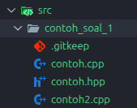
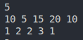
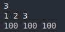
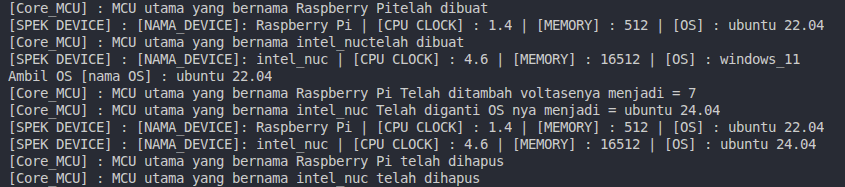
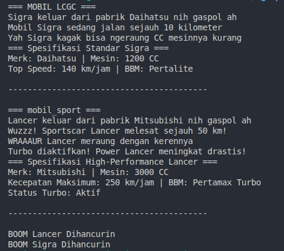
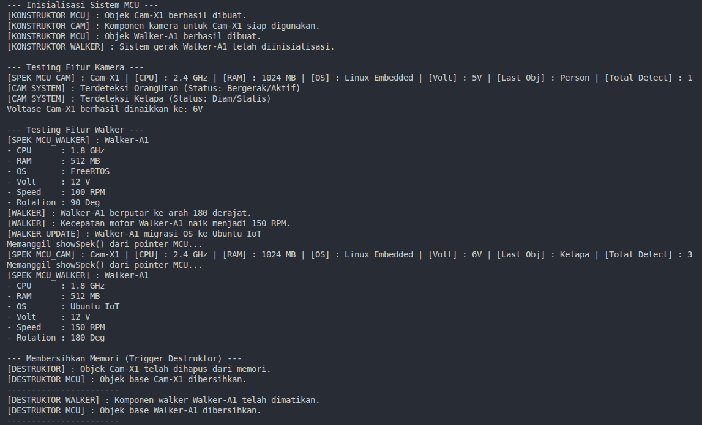

# SEKURO 25 Tugas 1 Divisi Programming

> Tenggat Waktu : **Rabu, 25 Maret pukul 23.59 WIB**

> Revisi: **Rabu, 21 Maret pukul 12.43 WIB**


### *[REVISI] :*
1. Perubahan Status Soal OOP:

    Soal No. 2 OOP kini dialihkan menjadi Soal Bonus. Pengerjaan bersifat opsional; jika dikerjakan, akan menjadi nilai tambah.

    Terdapat 1 Soal Wajib yang berkaitan dengan OOP yang menjadi soal alternatif bagi soal No. 1 OOP. Bagi Cakru yang sudah mengerjakan soal No. 1 OOP sebelum revisi ini, tidak perlu mengerjakan soal alternatif tersebut.

2. Ketentuan Struktur Folder & Penamaan:

    Bagi praktikan yang menggunakan fitur "Use this template" (bukan melakukan Forking), wajib mengubah nama folder/file soal no. 2 sebelumnya menjadi soal_2_bonus.

3. Update Repository (Khusus yang melakukan Fork):
Bagi Cakru yang melakukan Forking pada repository utama, silakan gunakan perintah Git berikut untuk melakukan sinkronisasi dan mengambil soal wajib terbaru:

```bash
# Menambahkan remote original (jika belum ada)
git remote add upstream [URL_REPO_UTAMA]

# Mengambil data terbaru dari upstream
git fetch upstream

# Melakukan merge ke branch utama kalian
git checkout main
git merge upstream/main

# Push kembali ke repository fork kalian
git push origin main
```

### *[PERINGATAN]*
- Silahkan klik "Use This Template" pada repo ini, lalu buatlah repository baru dengan format SEKURO_TUGAS_1_{Nama}_PROGRAMMING. Selain itu, Cakru *WAJIB* mengubah repository visibility menjadi public agar dapat dinilai. Pengumpulan repository yang private tidak akan diberikan nilai.
- Soal-soal berikut ini dapat diakses pada folder `soal`. Untuk pengumpulan, masukkan jawaban ke folder `src`. Berikut adalah contoh format cara menyimpan jawaban:

    

## ROS 2
Tugas ini akan mengevaluasi semua pengetahuan Cakru mengenai materi yang kalian pelajari pada Day 1 SEKURO 18 mengenai ROS 2. Penggunaan AI diperbolehkan, tetapi kami berharap Cakru tidak menggunakan AI secara penuh dalam mengerjakan tugas ini dan memanfaatkan materi yang telah diberikan agar Cakru benar-benar memahaminya.

1) Buatlah sebuah workspace ROS2 dengan sebuah package didalamnya (penamaan dibebaskan). Package tersebut akan mengandung program ROS2 yang mengandung seminimalnya satu publisher node, satu subscriber node, dan satu topic. Program ROS2 boleh dibuat sekreatif mungkin, tetapi minimal terdapat komunikasi antara node publisher dan node subscriber tersebut.
2) Jelaskan cara kerja program dari proses build hingga menghasilkan output, serta struktur folder workspace. Selain itu, jelaskan node dan topic yang sedang berjalan, informasi dari node dan topic tersebut, dan isi pesan dari topic yang telah dibuat. Rekam penjelasan dalam bentuk video dengan durasi maksimal 5 menit. Pastikan suara Cakru terdengar dengan jelas sepanjang video. Cakru tidak diwajibkan untuk menampilkan muka pada rekaman tersebut.


## Standard Template Library C++

### Robot Penjaga Gudang
> Gunakanlah <code>std::vector</code> dan <code>std::map</code> untuk mengerjakan soal ini

Sebuah robot penjaga gudang bergerak di sepanjang koridor lurus. Di koridor tersebut terdapat n buah paket yang diletakkan di berbagai titik koordinat x. Setiap paket memiliki sebuah ID Kategori (angka bulat).

Robot memulai perjalanannya dari koordinat terkecil yang memiliki paket dan bergerak hanya ke arah kanan (koordinat x yang semakin besar).

Robot memiliki misi untuk mengambil paket sebanyak mungkin. Namun, robot memiliki keterbatasan memori: Robot tidak boleh mengambil paket dengan kategori yang sudah pernah ia ambil sebelumnya.

**Tentukan berapa banyak paket maksimal yang bisa diambil oleh robot!**

### Format Input

Baris pertama berisi satu integer n (1≤n≤10^5) — jumlah paket.

Baris kedua berisi n integer xi(−10^9≤xi≤10^9) — posisi koordinat tiap paket.

Baris ketiga berisi n integer ci(1≤ci≤10^9) — ID kategori tiap paket.

### Format Output
Cetak satu bilangan bulat yang menyatakan jumlah paket maksimal yang dapat diambil.

### Contoh 1:

INPUT:



OUTPUT:


### Contoh 2:

INPUT:



OUTPUT:


## OOP
1) Lengkapilah file [core_mcu.cpp](src/soal_1_oop/core_mcu.cpp) serta [core_mcu.hpp](src/soal_1_oop/core_mcu.hpp) yang terdapat pada folder `soal`. Implementasikan kelas Core_MCU yang terdapat pada file-file tersebut agar `main.cpp` dapat dijalankan dengan output yang tertera di bawah ini! 



*[TIPS]*: Pelajarilah cara menggunakan konstruktor dan destruktor. Untuk soal ini, Cakru dapat untuk meng-compile program menggunakan g++ untuk mendapatkan outputnya.

1) *[ALTERNATIF]* Lengkapilah file [mobil.cpp](src/soal_1_oop_alternatif/mobil.cpp) yang terdapat pada folder `soal`. Implementasikan class `mobil` dan class `mobil_sports` agar `main.cpp` dapat dijalankan dengan output yang tertera di bawah ini!



*[TIPS]*: Pelajarilah cara inheritance dan override. Untuk soal ini, Cakru dapat meng-compile program menggunakan g++ untuk mendapatkan outputnya.

2) *[BONUS]* Lengkapi dan implementasikan file-file berikut agar `main.cpp` dapat dijalankan dan menghasilkan output seperti pada gambar di bawah ini. Gunakanlah prinsip-prinsip inheritance, virtualization, serta static. 
- [mcu.cpp](src/soal_2_oop/mcu.cpp)
- [mcu.hpp](src/soal_2_oop/mcu.cpp)
- [mcu_walker.cpp](src/soal_2_oop/mcu_walker.cpp)
- [mcu_walker.hpp](src/soal_2_oop/mcu_walker.hpp)
- [mcu_cam_controller.cpp](src/soal_2_oop/mcu_walker.cpp)

*[PERINGATAN]* [main.cpp](src/soal_2_oop/main.cpp) dilarang untuk diubah dihapus ataupun diedit.

Berikut output yang diharapkan:


## CMAKE
- Modifikasilah struktur folder pada soal `cmake` berikut [soal_cmake](soal/soal_cmake/) dengan menyalin seluruh file terkait ke dalam direktori folder jawaban Anda lalu atur strukturnya sesuai dengan gambar di bawah ini: 


Selanjutnya, lengkapi file [CMakeLists.txt](soal/soal_cmake/CMakeLists.txt) yang tersedia. Pastikan konfigurasi CMake dapat menghasilkan file eksekusi (.exe) di dalam folder ***bin*** setelah proses build selesai.


---

# GOOD LUCK !!!
